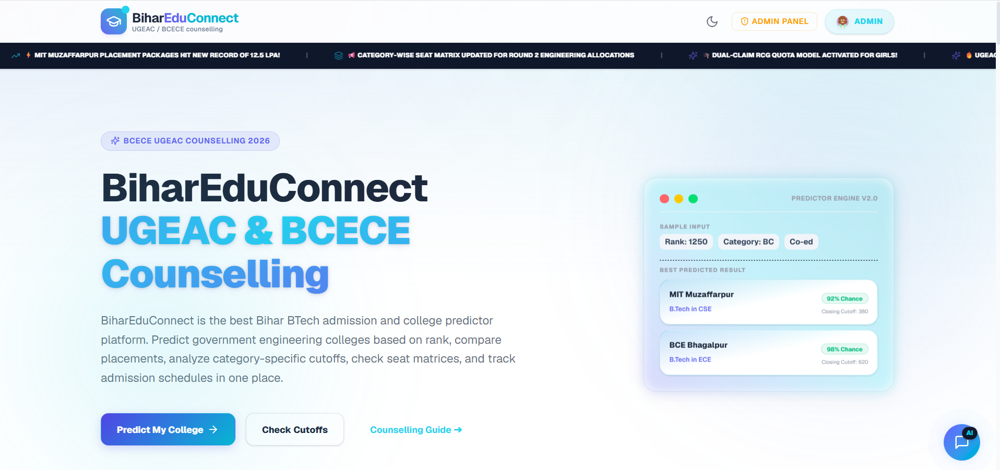

# ✦ Aryan Kumar — Creative Editorial Portfolio V4

<div align="center">

  

  <br/><br/>

  [](https://vitejs.dev/)
  [](https://developer.mozilla.org/en-US/docs/Web/JavaScript)
  [](https://www.w3.org/Style/CSS/)
  [](https://www.nita.ac.in/)
  [](LICENSE)

  <p align="center">
    <strong>A high-craft editorial portfolio exploring real-world engineering products, interactive systems, and intelligent tools.</strong>
  </p>

  <p align="center">
    <a href="#-key-features">Key Features</a> •
    <a href="#-interactive-orbital-wheel">Orbital Project Wheel</a> •
    <a href="#-featured-products">Featured Products</a> •
    <a href="#-tech-stack">Tech Stack</a> •
    <a href="#-getting-started">Getting Started</a> •
    <a href="#-connect">Connect</a>
  </p>

</div>

---

## ✦ Overview

This is the official personal website and product showcase of **Aryan Kumar**, an undergraduate developer and product builder at **NIT Agartala**. 

Designed with an **editorial-first aesthetic**, **buttery-smooth physics**, and **tangible tactile interactions**, this portfolio replaces cookie-cutter layouts with bespoke architectural mechanics — from a full **Interactive Radial Orbital Project Wheel** to **tactile retro Web Audio synthesizers**, **gamified micro-interactions**, and **in-depth case study overlays**.

---

## ✦ Key Features

### 🎡 1. Interactive 3D Orbital Selected Work Wheel
- **Polar Radial Distribution**: Automatically calculates mathematical coordinates ($360^\circ / N$) for all 11 projects.
- **Physics-Driven Rotation**: LERP interpolation with drag-to-spin gesture support, flick velocity, and magnetic snapping to the nearest project node.
- **Always-Upright Node Orientation**: Mathematical counter-rotation ensures project labels remain 100% horizontally level and legible at every rotation angle.
- **Dynamic Category Color Palettes**: Each project features its signature vibrant theme on spokes, badges, LED status indicators, and active glowing halo auras.
- **Auto-Orbit Engine**: Automated gentle ambient orbit with smart pause during user interaction, drag, touch, or keypress.

### 📖 2. Authentic Editorial Case Study Modals
- Powered by `project-overlay.js` and `projects-data.js`.
- Deep narrative breakdown for each project:
  - **Problem & Motivation** (*Why I built it*)
  - **Technical Architecture & Capabilities** (*How it works*)
  - **Verified Metrics & Live/GitHub repository links**

### 📻 3. Retro Cassette Audio Player Widget
- Authentic vinyl spools with real-time rotational state.
- Interactive playback controls, dynamic progress scrubbers, and synthesized Web Audio playground.

### 🎭 4. Atmospheric Micro-Interactions & Custom Characters
- **3D Floating Thinking Character**: Seated comfortably on interactive cloud hills.
- **Gardener Character & Watering-Can Cursor**: Interactive plant-watering mechanics with blossoming garden logic.
- **Live Canvas Starfield**: Deep celestial particle universe in Night Mode.
- **Dynamic Serif Word Rotator**: Smooth cross-fade headline engine (`Solves`, `Builds`, `Codes`, `Ships`).

### 🌓 5. Seamless Day / Night Cosmic Transitions
- **Day Mode**: Warm ivory paper aesthetic, golden-yellow sun disc, sky blue atmosphere, and soft natural shadows.
- **Night Mode**: Deep midnight cosmic indigo (`#080f1d`), glowing cyan/lime neon trails, and frosted dark glassmorphism.

---

## ✦ Featured Products (11 Core Systems)

| # | Project | Category | Key Capabilities & Tech Stack |
|---|---|---|---|
| **01** | **[BiharEduConnect](https://github.com/Aryankashyapnit/BiharEduConnect)** | Counselling Intelligence | Rank predictor for 44+ nodal Bihar engineering colleges. *(Next.js 14, TypeScript, Supabase, PostgreSQL)* |
| **02** | **[Decide](https://github.com/Aryankashyapnit/decide)** | Conversational AI & Mobile | AI thinking partner for complex trade-off reasoning and mental models. *(Flutter, Dart, FastAPI, Gemini API)* |
| **03** | **[PolytechnicKarle](https://github.com/Aryankashyapnit/Polytechnickarle)** | State Admissions | Bihar DCECE diploma seat forecasting and rank prediction engine. *(React, Node.js, PostgreSQL, Tailwind)* |
| **04** | **[BEUCampus / CampusMesh](https://github.com/Aryankashyapnit/CampusMesh)** | Academic OS | Complete Android operating system for notes, attendance & university archives. *(Kotlin, Jetpack Compose, Room)* |
| **05** | **[Raksha-AI](https://github.com/Aryankashyapnit/-Raksha-AI)** | Safety & Geotracking | High-contrast emergency safeguard app with sub-second SOS dispatch. *(Flutter, FastAPI, Geolocation, WebSockets)* |
| **06** | **[CollegeAchiever](https://github.com/Aryankashyapnit/collegeachiver)** | AI Admissions | Nationwide JoSAA rank predictor analyzing 17,000+ opening/closing cutoffs. *(Next.js, React, Node.js)* |
| **07** | **[Zameen Calculator](https://github.com/Aryankashyapnit/Zameen-calculator)** | Regional Utility | Regional land unit converter (Katha, Bigha, Dhur to Sq. Ft / Acres). *(TypeScript, HTML5, Web Standards)* |
| **08** | **[MemeSoundboard](https://github.com/Aryankashyapnit/MemeSoundboard)** | Audio Playground | Low-latency Web Audio soundboard with synthesized effects and keyboard hotkeys. *(Web Audio API, JavaScript)* |
| **09** | **[Git Connect](https://github.com/Aryankashyapnit/git-connect)** | Dev Networking | Student developer networking platform matching GitHub commit profiles. *(React, Node.js, GitHub REST API)* |
| **10** | **[SmartKitchen](https://github.com/Aryankashyapnit/SmartKitchen)** | Smart Utility | Pantry grocery expiry tracker and ingredient-to-recipe recommendation AI. *(React, Local Storage, Tailwind)* |
| **11** | **[LabEase](https://github.com/Aryankashyapnit/LabEase)** | Academic Tool | Centralized digital laboratory manuals, circuit schematics, and viva sets. *(HTML5, CSS3, Markdown)* |

---

## ✦ Tech Stack

- **Core**: HTML5, Vanilla JavaScript (ES6+ Modules)
- **Styling**: Vanilla CSS3 (Custom Design System, CSS Custom Properties, Glassmorphism, 3D Transforms)
- **Typography**: `Instrument Serif`, `Plus Jakarta Sans`, `Space Grotesk`, `Caveat`
- **Build & Dev Tooling**: [Vite](https://vitejs.dev/)
- **Audio & Visual**: Web Audio API, HTML5 Canvas 2D, SVG Filters

---

## ✦ Getting Started

### Prerequisites
Make sure you have [Node.js](https://nodejs.org/) (version 18 or higher) installed.

### Installation

1. **Clone the repository**:
   ```bash
   git clone https://github.com/Aryankashyapnit/MY-Portfolio.git
   cd MY-Portfolio
   ```

2. **Install dependencies**:
   ```bash
   npm install
   ```

3. **Start the local development server**:
   ```bash
   npm run dev
   ```
   Open [http://localhost:3000](http://localhost:3000) in your browser to see the live portfolio.

4. **Build for production**:
   ```bash
   npm run build
   ```
   The production-ready bundle will be output to the `dist/` directory.

---

## ✦ Project Structure

```
├── assets/                 # High-resolution screenshots, mockups & project previews
├── src/
│   ├── main.js             # Application bootstrap & event orchestration
│   ├── scripts/
│   │   ├── project-wheel.js      # Interactive 3D orbital wheel engine & physics
│   │   ├── project-overlay.js    # Case study modal popup & deep dive view
│   │   ├── projects-data.js      # Authentic data store for all 11 projects
│   │   ├── theme-toggle.js       # Smooth Day/Night mode transition manager
│   │   ├── audio-player.js       # Retro cassette tape audio engine
│   │   ├── interactive-widgets.js# Playground widgets & UI micro-interactions
│   │   ├── gardener-character.js # Animated gardener & watering can cursor
│   │   ├── hero-character.js     # Floating cloud thinking character
│   │   ├── starfield.js          # Celestial canvas starfield generator
│   │   └── word-rotator.js       # Hero headline word cross-fade rotator
│   └── styles/
│       ├── variables.css         # Design tokens, color palettes & theme variables
│       ├── base.css              # Global resets, container grids & smooth scroll
│       ├── hero.css              # Sky hero banner, audio cassette & typography
│       ├── featured-projects.css # Orbital project wheel & spotlight card styles
│       ├── project-overlay.css   # Full editorial case study modal styles
│       └── ...
├── index.html              # Main HTML entry point
├── package.json            # Scripts & dev dependencies
└── vite.config.js          # Vite configuration
```

---

## ✦ Connect

- **Portfolio**: [aryan-portfolio.app](https://github.com/Aryankashyapnit/MY-Portfolio)
- **GitHub**: [@Aryankashyapnit](https://github.com/Aryankashyapnit)
- **Institution**: National Institute of Technology (NIT), Agartala
- **Location**: Tripura / Bihar, India

---

<div align="center">
  <sub>Crafted with code, curiosity, and product craft by <strong>Aryan Kumar</strong> © 2026.</sub>
</div>
